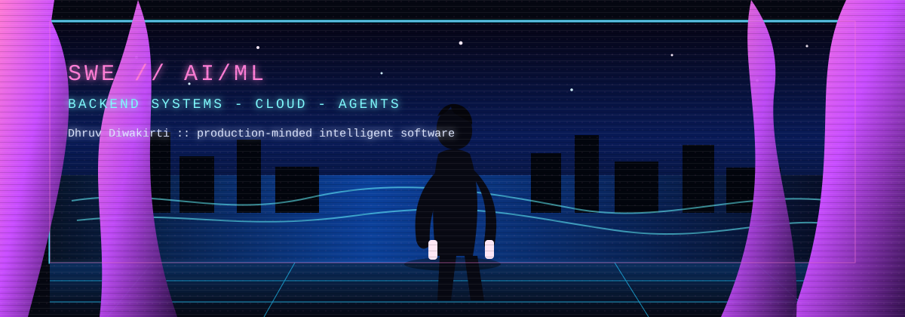

<div align="center">




[](https://www.linkedin.com/in/dhruvdiwa/)
[](mailto:loltreat1@gmail.com)
[](https://github.com/Dhruv-kys)

<br />


</div>

## SYSTEM PROFILE // SWE x AI/ML

I am **Dhruv Diwakirti**, a Computer Science undergrad at **JSS Academy of Technical Education, Noida** and a **Software Engineering Intern** building backend-heavy **AI/ML systems**.

My lane is where software engineering meets intelligent products: APIs that stay clean, pipelines that do not fall apart, model integrations that are useful, cloud pieces that actually ship, and real-time systems where latency matters.

```yaml
role: SWE Intern focused on AI/ML systems
mode: backend-first, cloud-aware, product-minded

domains:
  - AI/ML applications
  - backend APIs and async services
  - RAG, agents, and MCP tool servers
  - speech, transcription, and real-time ASR
  - AWS-based serverless AI workflows
```

## STACK SIGNAL

```text
AI/ML        RAG, embeddings, LangChain, FAISS, OpenAI, Hugging Face, AWS Bedrock, MCP
Backend      Python, FastAPI, Node.js, REST APIs, PostgreSQL, Docker
Cloud        AWS Bedrock, Lambda, S3, GCP, GitHub Actions, Vercel
Frontend     JavaScript, TypeScript, React, Vue
Systems      async pipelines, STT/TTS, diarization, ASR routing, observability-minded APIs
CS Core      DSA, OOP, DBMS, OS, computer networks
```

<div align="center">


</div>

## NIGHT CITY BUILDS

| Project | What it proves | Stack |
|---|---|---|
| **[AUDEX](https://github.com/Dhruv-kys/AUDEX)** | Full-stack audio transcription and analysis with AI evaluations | React, FastAPI, STT, diarization |
| **[HireSense AI](https://github.com/Dhruv-kys/HireSense_AI)** | Real-time AI interview flow with voice input and follow-up reasoning | FastAPI, OpenAI, STT/TTS |
| **[realtime-Dubai-ASR](https://github.com/Dhruv-kys/realtime-Dubai-ASR)** | Speech pipeline work around real-time ASR routing | Python, ASR, audio systems |
| **[AWSbedrock-PDF-system](https://github.com/Dhruv-kys/AWSbedrock-PDF-system)** | Document QA with retrieval and cloud LLM infrastructure | AWS Bedrock, LangChain, FAISS |
| **[Aws-Bedrock-Blog-Generator](https://github.com/Dhruv-kys/Aws-Bedrock-Blog-Generator)** | Serverless AI content pipeline with API-triggered generation | AWS Bedrock, Lambda, S3 |
| **[ExpenseMCP](https://github.com/Dhruv-kys/ExpenseMCP)** | MCP server exposing financial tools to LLM agents | Python, MCP, agents |
| **[VitalSense](https://github.com/Dhruv-kys/VitalSense)** | Health-tech workflow with ML/product engineering focus | Python, ML, app engineering |
| **[LANGCHAIN-AGENT-Chatbot](https://github.com/Dhruv-kys/LANGCHAIN-AGENT-Chatbot)** | Multi-tool reasoning chatbot with contextual behavior | LangChain, Python, agents |

## BUILD MANIFEST

```text
01. make the backend boringly reliable
02. wire AI/ML where it creates real leverage
03. keep latency visible and failure paths handled
04. prefer shipped systems over shiny prototypes
05. learn the stack deeply enough to debug it at midnight
```

## TELEMETRY

<div align="center">


</div>

---

<div align="center">

**Open to SWE / AI Engineering Intern roles where I can build AI/ML products, backend systems, and cloud workflows that hold up outside the demo.**

</div>
